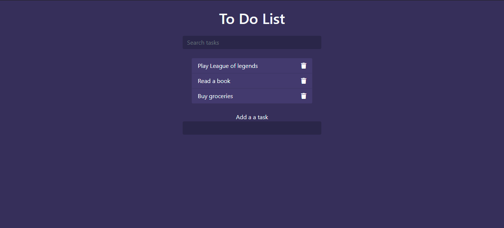
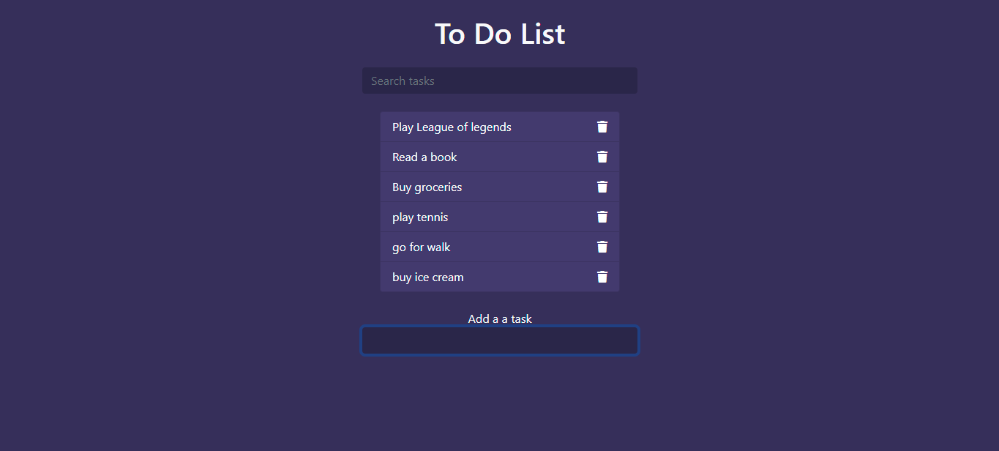
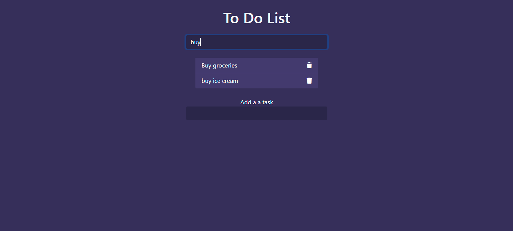
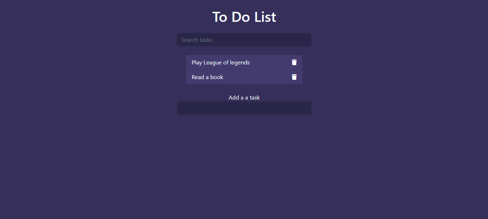
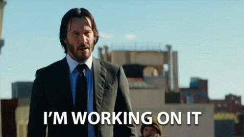

### This is a simple Todo app built using the following:-

# This is the layout of the page :boom: 

## After adding task :page_facing_up: 

## Searching for task :mag:

## After deletion:- 

 

# UI changes??

